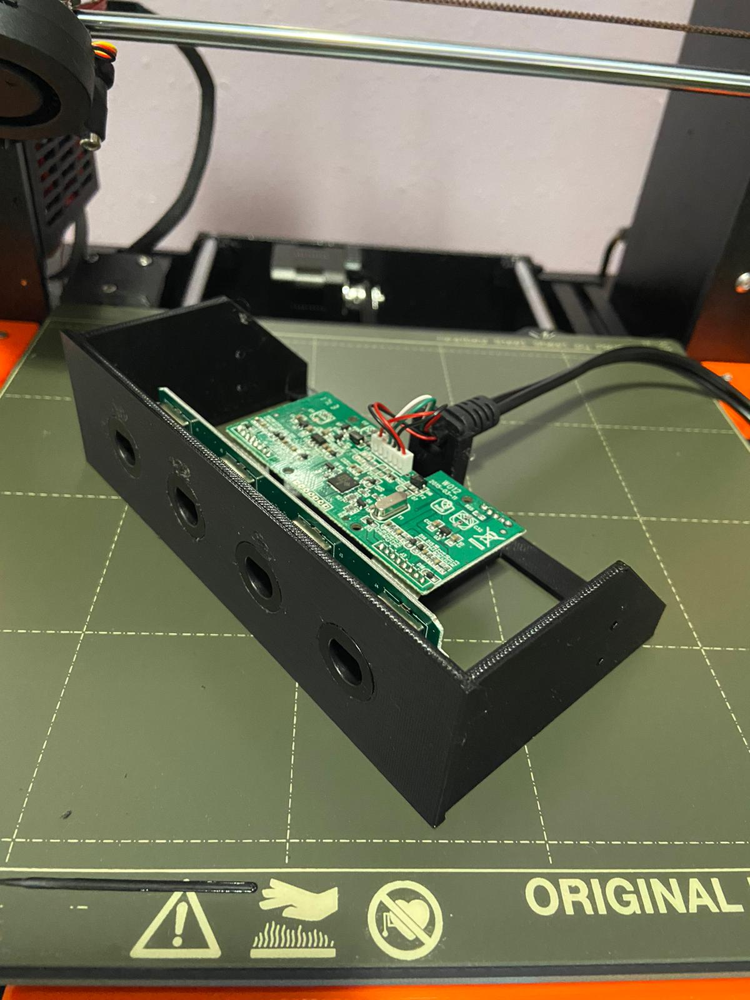
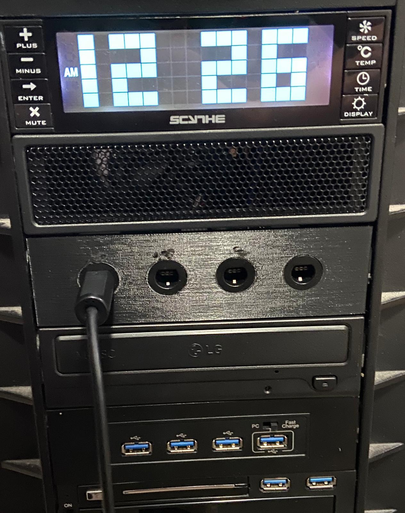

# 5.25" Bay Adapter for Gamecube Controller Adapter... Adapter

This is a 3D model of a bracket adapter to mount a [Mayflash Wii U/PC USB Gamecube Controller Adapter](https://www.amazon.com/Mayflash-GameCube-Controller-Adapter-Switch/dp/B00RSXRLUE)'s internals inside a standard 5.25" drive bay slot. Because, y'know, why not.

This was inspired by [https://www.thingiverse.com/thing:1948219](https://www.thingiverse.com/thing:1948219), which uses the official adapter instead of this offbrand one. I did print that and get it installed, but the official adapter requires some _nasty_ driver manipulation to get working properly - this one just works.

See [gamecube-5.25-bay.stl](gamecube-5.25-bay.stl) in this repo for a 3D preview.

*If you print this, please let me know - it'd make me real happy.*

## Pics

(Note the screw holes being unused - my first version had the posts flipped around and were useless)

## Assembly

1. Slice and print (note - if your printer isn't terribly accurate, you probably won't have great results - my measurements were somewhat precise). I did 0.15mm layer height with generic PLA and no supports - I had to do a _little_ bit of cleanup with a dremel for the port overhangs, but it turned out mostly ok.
2. Make sure the switch on the adapter is in the "PC" position, then disassemble the adapter. Keep at least 4 of the screws, but you can toss the plastic shell if you want. Be careful not to wiggle the ribbon cables between the two boards too much - the wires don't seem that strong and I was worried about breaking them all constantly.
3. Once the print is complete and cleaned up, start attaching the board by sliding the ports in first. You _may_ want to dremel out some space in the ports if your printer didn't handle the overhang super well (but be careful - you can see the marks I accidentally made above a few of the ports in my pics). Once the ports pop in, they should slide into the little clips on the riser in there. Be gentle, but firm.
4. Use the 4 screws from the original case to attach the main board to the riser posts.
5. Slide the cord into the little stand for it. It should be a pretty snug fit.

## Installation

Really just like any other 5.25" bay device - slide the cables in first, then connect via the mounting holes. My case is a tool-less design and that worked just fine, but standard M3 screws _should_ work as well. If you have internal USB ports, you can connect via those - I ended up removing a PCI slot cover from the back of the case and threading the cables out to the rear ports through that (my desktop _is_ a rat's nest of cabling, thanks for asking).

## Anyway

Now I've got gamecube ports on my desktop. Hooray?
